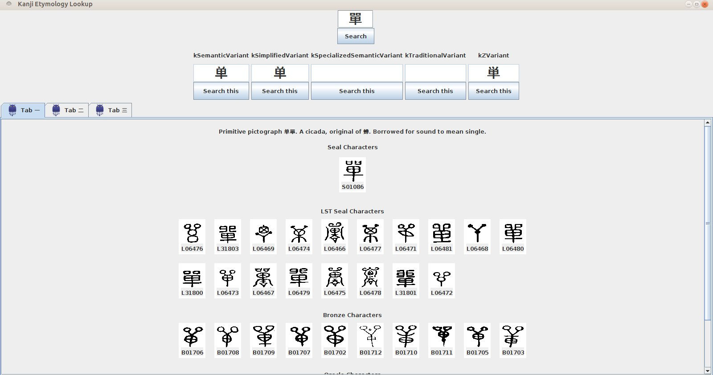
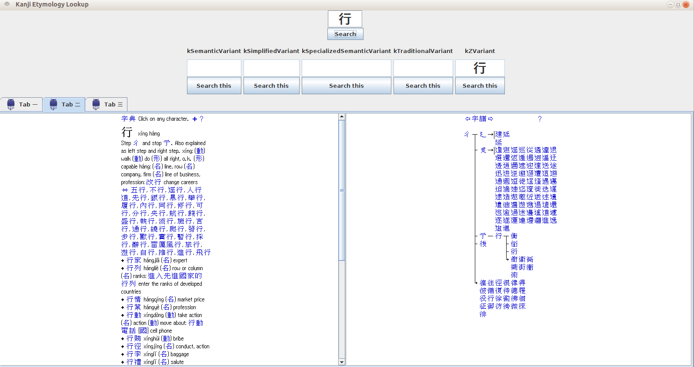
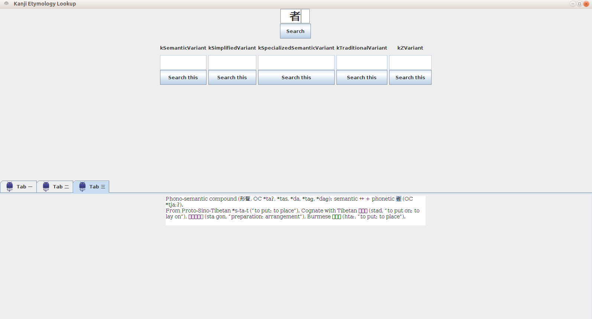

# KanjiEtymLookup
Run the file from /tabbedwindow/KanjiEtymLookup.java

**Requirements: [Jsoup](https://jsoup.org/)**

The program can fetch results from [ChineseEtymology](http://chineseetymology.org), [Zhongwen](http://zhongwen.com/) and [Wictionary](https://en.wiktionary.org/wiki/Wiktionary:Main_Page). If you want to fetch results from some other site, create a separate package for with the main class extending JPanel and add it to /tabbedwindow/KanjiEtymLookup.java (make sure to add hook for the searchButtonListener). 

Search results from Wictionary fetches only the etmology text since the glyph images are already fetched from ChineseEtymology (more than what Wictionary offers). 

Screenshots:
---

---

---

